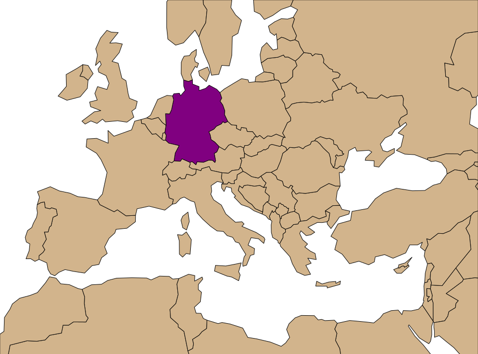

.. svgis documentation master file, created by
   sphinx-quickstart on Tue Jan 26 11:23:58 2016.
   You can adapt this file completely to your liking, but it should at least
   contain the root `toctree` directive.

Welcome to svgis's documentation!
=================================

Create SVG drawings from vector geodata files (SHP, geoJSON, etc).

SVGIS is a command line tool for creating many small maps. It's designed to
fit well with the Unix toolkit, and play nicely in a workflow, e.g. Makefile.

It also excels at basic maps that can be later elaborated in a drawing program
(e.g. Illustrator).

With SVGIS, a command like this:

.. code:: bash

    svgis draw ne_110m_admin_0_countries.shp \
    --bounds -10 30 40 60 \
    --project EPSG:3035 \
    --scale 5000 \
    --id-field name \
    --style ".ne_110m_admin_0_countries {fill: tan;} #Germany { fill: purple }" \

Generates a map like this:

SVGIS is built on top of `GDAL/OGR <http://www.gdal.org>`_, so it can read just
about any geodata file format you throw at it.

This documentation assumes some familiarity with 
`CSS <https://developer.mozilla.org/en-US/docs/Web/CSS>`_, how map projections
work, assumes you have some geodata at your disposal. If you don't know where to
find geodata, `Natural Earth <http://naturalearthdata.com>`_ is a great place to start.

.. toctree::
   :maxdepth: 2

   cli
   styles
   api/index

* :ref:`genindex`
* :ref:`search`
